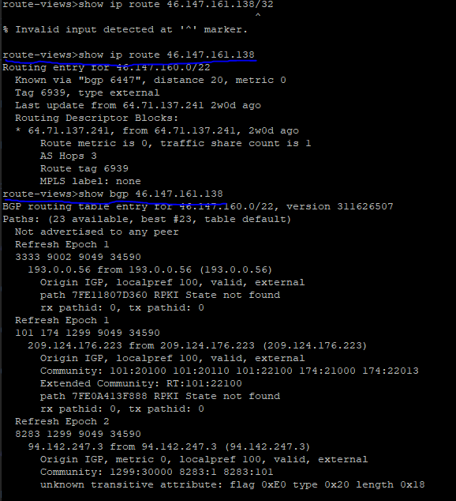
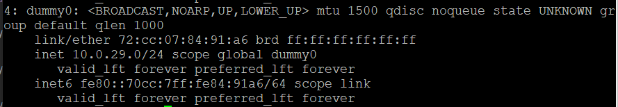
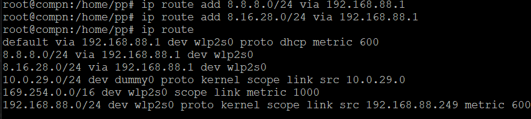
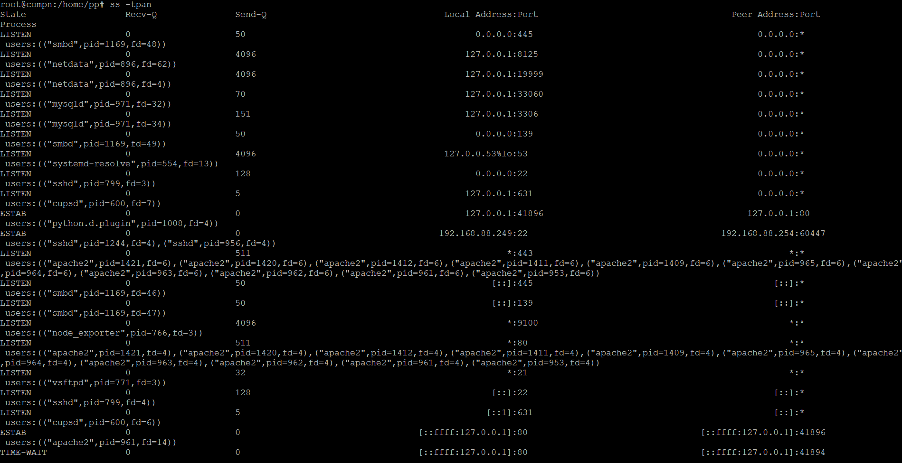
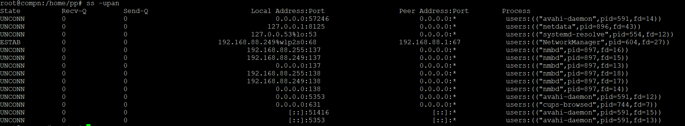
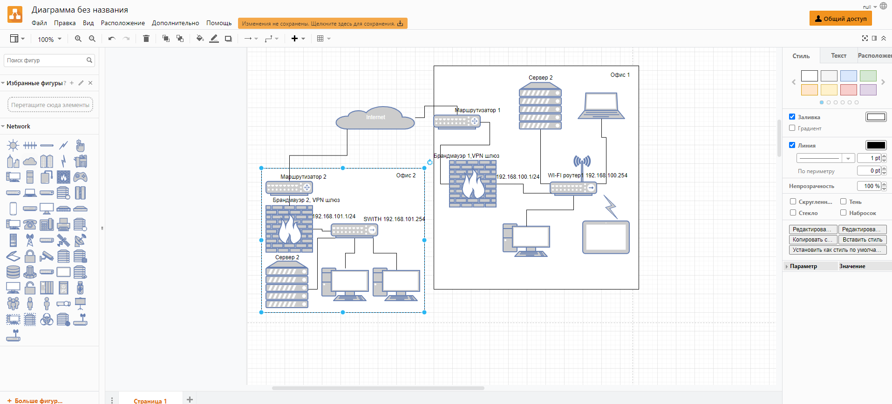

# Домашнее задание к занятию "3.8. Компьютерные сети, лекция 3"

1. Подключитесь к публичному маршрутизатору в интернет. Найдите маршрут к вашему публичному IP
```
telnet route-views.routeviews.org
Username: rviews
show ip route x.x.x.x/32
show bgp x.x.x.x/32
```
>
2. Создайте dummy0 интерфейс в Ubuntu. Добавьте несколько статических маршрутов. Проверьте таблицу маршрутизации.
```# ip link add dummy0 type dummy
# sudo ip addr add 10.0.29.0/24 dev dummy0
# sudo ip link set dummy0 up
# ip address
```


3. Проверьте открытые TCP порты в Ubuntu, какие протоколы и приложения используют эти порты? Приведите несколько примеров.

>22 - TCP,UDP - под SSH соединение,  
> 80,445 apache  
>9100 node_exporter  
> 3306 mysqld  

4. Проверьте используемые UDP сокеты в Ubuntu, какие протоколы и приложения используют эти порты?


5. Используя diagrams.net, создайте L3 диаграмму вашей домашней сети или любой другой сети, с которой вы работали. 

